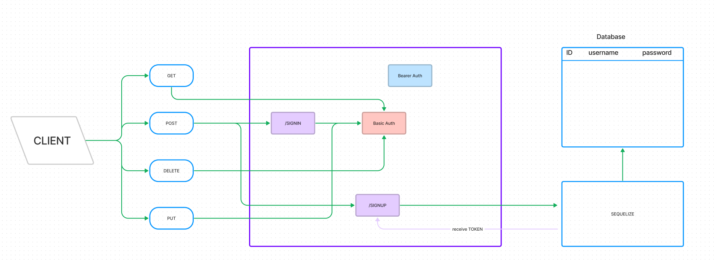

# LAB - Class 08

## Author: Tim Traylor

### Problem Domain

This lab demonstrates how to implement an Express API complete with authentication and authorization functionality, restricting access to routes that manipulate a database with food and clothes information

#### Running the app

- `npm start` or `nodemon` (if you have nodemon) to start the application.

#### Features / Routes

Model Routes

- GET : `/food` or `/clothes`
- GET : `/food/id` or `/clothes/id`
- POST : `/food` or `/clothes`
- PUT : `/food/id` or `/clothes/id`
- DELETE : `/food/id` or `/clothes/id`

Auth Routes

- POST : `/signup`
- POST : `/signin`
- GET : `/users`

Other Routes

- GET : `*` - catch-all route

#### Tests

- `npm test` to run tests

#### UML Diagram

Diagram created with [Figma](https://www.Figma.com/)
